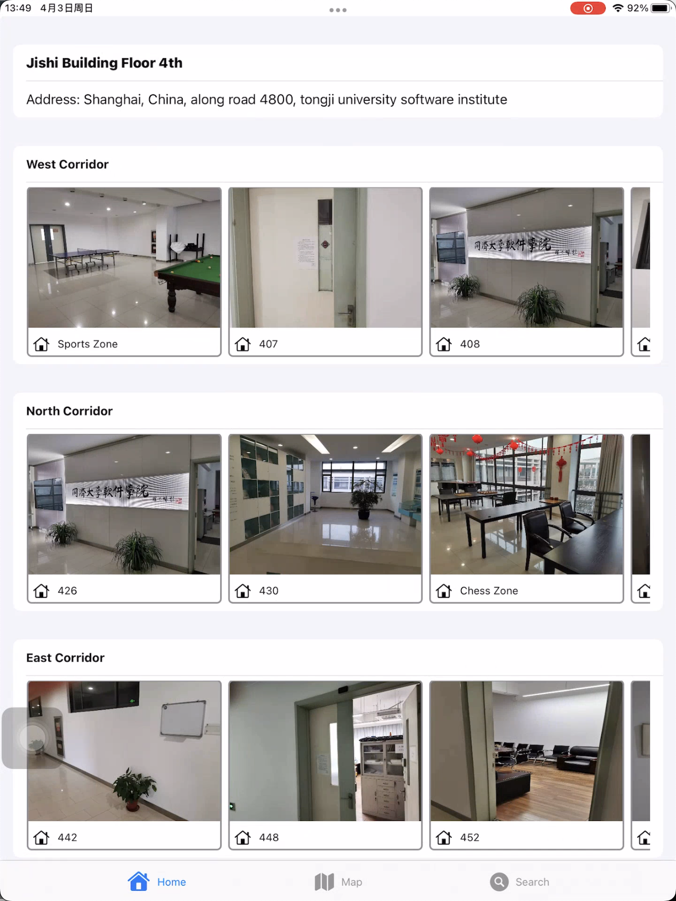

# HCI-assignment 1

- Student: 1951724 陈垲昕
- Operating System: MacOS Monterey 12.3.1
- Develop Tools: Xcode 13
- Language: Swift
- Framework: SwiftUI, Mapkit

## **Interaction & Fluid Navigation Display**

### **Home Page Design: Navigation by Selection**

the rooms on the 4th Floor, Jishi Building is divided into 3 hallways. Considering that the number of the rooms of each hallway is limited, each of the hallways is represented with a scroll view. Each room is displayed with graphical techniques that allow users to tap/select them and check out the detailed information.

A snapshot of the home page:

A snapshots of the detailed room information page (after clicking on the card view of the room):

### Map View Design

using Swift Mapkit to get a bird view of the Jishi Building, with clickable pins indicating the location of each room on the 4th floor. By tapping on it, user can get into the previous detailed room view.  This allows user to quickly understand the geographical distribution of each room.

A snapshot of the map view:

## Search View Design

Apart from the search bar, the brief display of the search result is represented with grid menu(since the total number of the results is still very limited, using grid menu is very intuitive).

By searching the substring of the room name as well as the tag key word of the room, users can have a clear vision of the search result, which is still a link to the detailed room view.

A snapshot of the search view:

